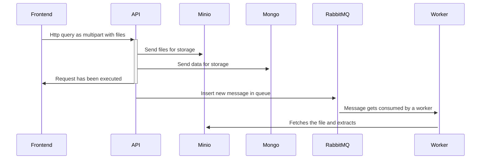
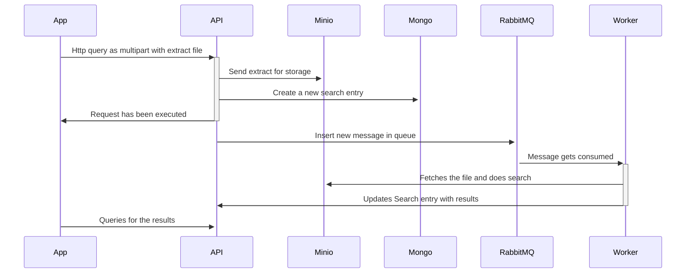

# Architecture

## Api

As a central element of the architecture, API acts as a gateway to our different services, that frontends access.

## MongoDB

MongoDB persists the most basic stuff: Users, buisness entities...
MongoDB's flexibility allowed us to get this POC running in no time.

## RabbitMQ

Audio fingerprinting is a costly operation that takes time. This is why, for scalability reasons it's good to have it made by independent workers. RabbitMQ allows having a queue of tasks that summons worker to process audio samples and output their generated fingerprints, for them to be indexed for further comparison.

## FP Worker

FingerPrinting workers are atomic entities that only exist to process audio and turn it into fingerprints. Those fingerprints are then sent to the database.

## Minio

Storing files is a tricky tasks, especially at scale. This is why we use an object storage to store pictures, resources, and tracks. Minio has the advantage of being open source and fully self hosted.

## Elastic Search

ES allows us to implement an efficient, fast, and robust search system. The user can search for other users, tracks, releases, resources, or resource packs.

## Kibana

Leveraging ES and filebeat, we can have indexed logs from the API, and search them efficiently whenever needed, this allows for great alanytics of the application, we can know exactly how it runs and what happened when it doesn not run properly.

## Filebeat

Filebeat retrieves logfiles and sends them to Kibana.

## Android app

For a music streaming platform, an Android app is an absolute must. Track retrieving via samples can also be done through that android app. It uses the same API endpoints as the frontend.

## Frontend

The frontend is made using Svelte and SSR for an optimal SEO, allowing artists to get more visibility.

## Complex interactions

### Release upload:

### Audio lookup via fingerprinting:

