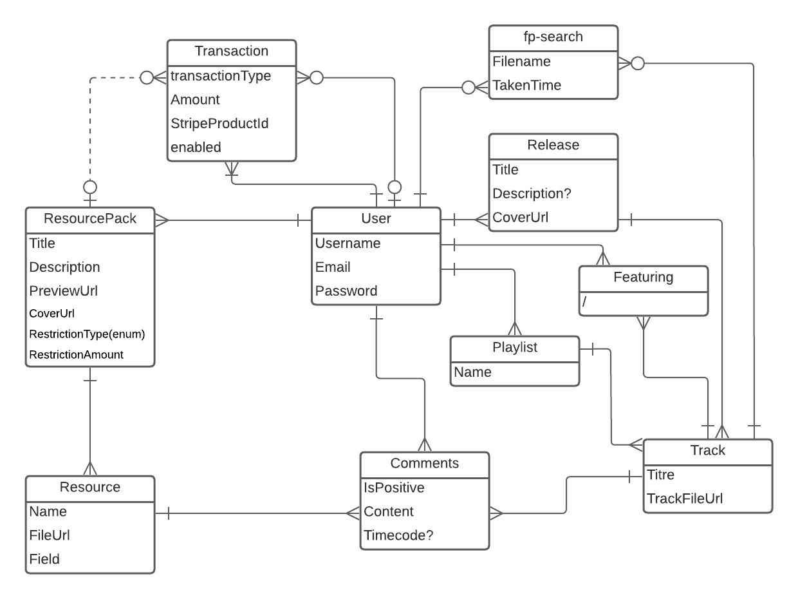

# Entities

## UML

## User

Every user is considered an artist before they post, to encourage creation and participation in the platform.
Before a user can publish paid resource packs, they need to get the Stripe onboarding done so that they can get paid.

## Release

A release is a list of tracks that are release together. it can be an EP, an Album, an LP, or a Single. Any released track has to be included in a release, There can be no stray track.
A release has a cover art.

## Track

A track is a song, or.. well.. a track. This entity allows retrieving the audio file for reading purpose. There are one or several Track per Release.

## Comment

Uni-verse's like/dislike system has the particularity to require a description justifying it.
The idea behind this is to encourage constructive criticism.

## ResourcePack

Uni-verse allows sharing resource packs, containing samples and VST presets.
This way, creators can exchange stems to inspire each other.
Creating a resource pack can be very demanding and that's why uni-verse allows people to sell their resource packs on the platform.

## Resource

A resource is an element of a resource pack. It ultimately is a file, whether it be a sample or a preset.
It can be previewable or not, which allows having a peek at resource packs before buying them.

## FpSearch

A fingerprint search is any search that has been done by a user in uni-verse's database. Keeping this allows making statistics. This could be implemented via Kafka in the future, for further efficiency.

## Featuring

A user can be linked to a track via this `featuring` entity. This allows making sure that credits are rightfully given: it allows linking a track with everyone that has worked on it.

## Playlist

Users can create playlists, which point to different tracks. The usual playlist feature.

## Transaction

Transations means money transaction. It can be whether the purchasing of a resource, or a donation from a user to another (that has stripe onboarding done).
