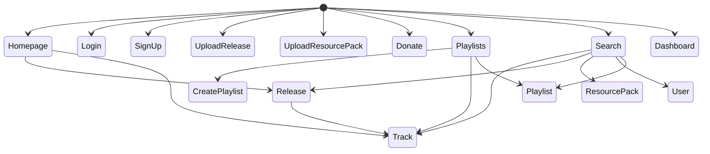

# Frontend

The web frontend for Uni-verse is its main frontend application.

It allows using any Uni-verse feature, except for the audio recognition feature.

Uni-verse's frontend was originally written in React. Because it relied on too many dependencies, it impossible to run it now as it used to.

You can check its current state [here](https://uni-verse.vagahbond.com).

It is now undergoing a total rewrite in [Sveltekit](https://kit.svelte.dev).

Here is its structure:

## Website's basic structure:

