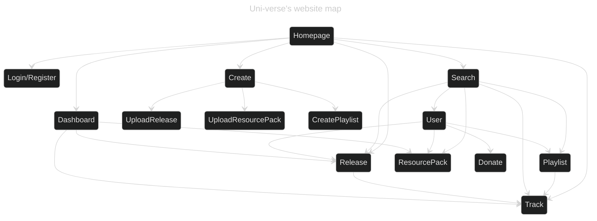

# Frontend

The web frontend for Uni-verse is its main frontend application.

It allows using any Uni-verse feature, except for the audio recognition feature.

Uni-verse's frontend was originally written in React. Because it relied on too many dependencies, it impossible to run it now as it used to.

It is now undergoing a total rewrite in [Sveltekit](https://kit.svelte.dev).
You can check its current state [here](https://uni-verse.vagahbond.com).

It is meant to include:
- Playlist management
- Resource and Release uploads 
- Account management 
- Messaging 
- Searching users, playlists, tracks, releases, resource packs and resources
- Listening to music
- Previewing resource packs

Here is its structure:

## Website's basic structure:

This structure is subject to change as we implement the remaining missing features.

More to come as the app is built !
